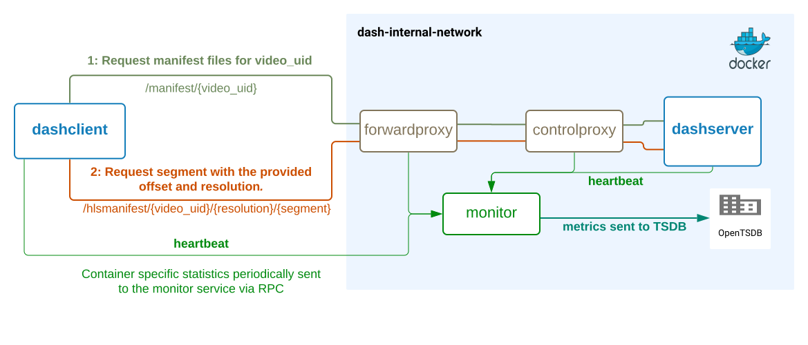

## Project Overview - Dynamic Adaptive Streaming over HTTP (DASH) Lab

Project streams video content between a client and server using the DASH protocol. The project provides a means of capturing and modifying DASH network 
traffic. I intend to use this project to explore the identifiable pattern which is leaked in a subset of DASH videos and test noise generation techniques to obfuscate said pattern.

Communications between client and server pass through two proxies:
- **forwardproxy**: an intermediary host along the network path between client and server. Data is captured at this point.
- **controlproxy**: proxy which intercepts traffic between client and server. 
Initial purpose is to simulate network conditions through introduction of delays and test pattern obfuscation through the introduction of noise to the traffic.

Statistics are gathered on each container and delivered to the monitor container:
- **monitor**: the monitor service aggregations RPC from each of the containers in this system. Data is then extracted, converted into metric format, and delivered to an OpenTSDB.
This instance is the data source for a local Grafana instance.

------

# DASH
Dynamic Adaptive Streaming over HTTP (DASH) is a streaming protocol which has been widely adopted by modern streaming service providers. DASH's popularity is due to its effectiveness at improving the end users Quality of Experience (QoE)
 by optimizing for reduction of video stalls during a viewing session. DASH achieves improved QoE by varying the quality of the video across time in response to changing network conditions.

### How DASH works

- A video is encoded into various distinct representations of varying bitrate levels. Each representation is then segmented across time. The details of segmented/encoded representation are captured in a manifest file.
- DASH client requests the manifest for the video they wish to stream. The manifest will be used as reference material as they sequentially request video segments.
- Sequential retrieval of video segments occurs in two phases:
  - Initial playback buffer hydration; the client will request n segments to fill the playback buffer of t seconds. 
  - Steady state mode; the client will request segments from the server once the buffer dips below t seconds. A full buffer is a healthy buffer, signifying the client’s ability to hydrate the buffer in excess of the video players data ingestion requirements.

#### Unhealthy playback buffer

A depleting buffer indicates a lag in segment retrieval and forewarns of a video stall if not remediated.
Likely cause of delayed segments is poor network conditions. Client adapts by requesting segments of lower quality until a healthy hydration level has been achieved.
The main tradeoff here being between video quality for video continuity.

## Vulnerability

The sequential delivery of segments exposes DASH to side channel attacks. Specifically, the bytes per second of the segments traversing the network, even in encrypted communication,
leaks an identifiable pattern for a subset of videos.
- **[To be explored];** the Advanced Video Coding (AVC), H.264 for example, seeks to reduce the size of the video based on visual elements within the video, such as temporal and spatial redundancy.
  - **Temporal Redundancy (Inter-frame Compression)**
    - Given a set of consecutive frames with little variance, rather than sending frames for each, we send an initial frame which represents the initial scene and the delta describing how the scene changes across time.
  - **Spatial Redundancy (Intra-frame Compression)**
    - The frame is divided into blocks and only the difference between these blocks is encoded. 

**[to be explored]** visual elements across time which make a video unique result may result in a unique encoded representation, an video fingerprint. I suspect it is this unique-encoded representation which is leaked in DASH's sequential segment delivery mechanism.

